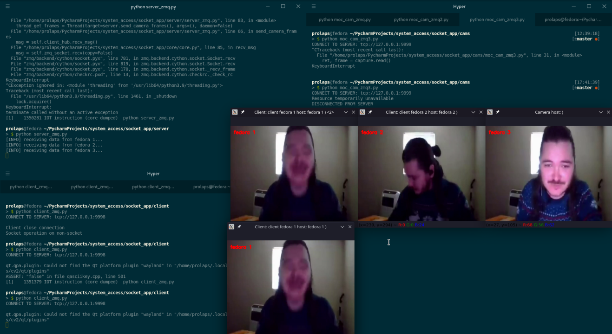
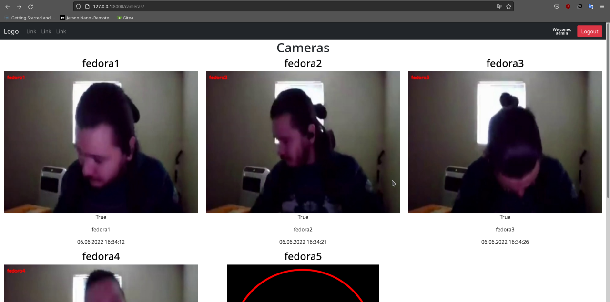

# TorchCCTV

video surveillance system based on ZMQ and PyTorch

## Face detected and recognition

Face recognition using ArcFace

## Anti Spoofing system

Anti-Spoofing for Face Recognition task using the Deep Pixel-wise Binary Supervision 
or Central Difference Convolutional Network 

## Video surveillance system

### SocketApp

Video server, client and moc camera console app

#### Socket

SocketApp based on python socket
#### ZeroMQ

SocketApp based on ZeroMQ REQ/REP pattern
### WebUI

Django project with simple authorization using postgres

